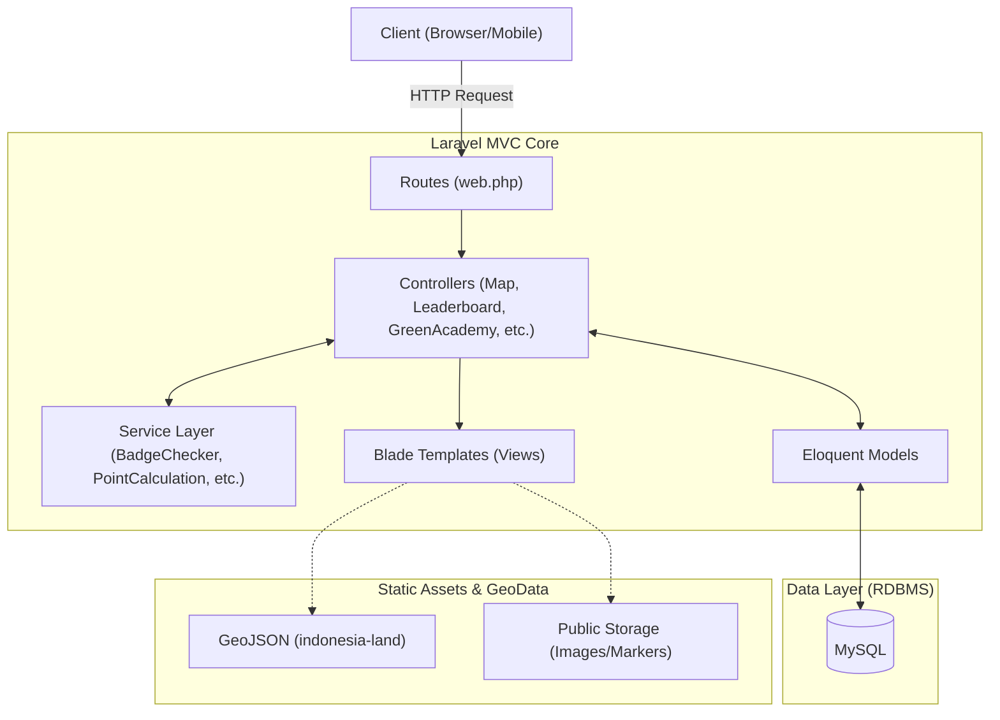

## Deskripsi Proyek

**Eco Ranger Tourism** adalah sistem informasi pariwisata berbasis web yang dirancang untuk mempromosikan pariwisata ramah lingkungan dan berkelanjutan. Dibangun menggunakan framework **Laravel**, sistem ini memadukan interaksi pemetaan geografis, edukasi lingkungan, serta gamifikasi untuk mendorong pengguna berpartisipasi aktif dalam menjaga kelestarian alam saat berwisata.

Sistem ini memfasilitasi interaksi antara pengelola wisata, agen lingkungan, dan wisatawan melalui berbagai fitur interaktif seperti pelaporan kondisi lingkungan, manajemen poin dan *reward*, hingga forum diskusi komunitas.

### Fitur & Karakteristik Utama

1. **Sistem Pemetaan Interaktif (Interactive Eco-Map):**
   Visualisasi titik-titik destinasi wisata (`Destinasi`) dan penanda spasial (`Markers`) yang terintegrasi dengan data GeoJSON (wilayah darat dan laut Indonesia).
2. **Gamifikasi & *Reward* (Gamification):**
   Menerapkan sistem poin (`PointLedger`, `PointRule`), pencapaian lencana (`Badge`), serta papan peringkat (`Leaderboard`) untuk memotivasi tindakan ramah lingkungan. Poin yang dikumpulkan dapat ditukarkan dengan voucer wisata (`Voucher`).
3. **Green Academy:**
   Modul edukasi terintegrasi yang menyajikan artikel pelestarian lingkungan dan kuis (`Kuis`) untuk meningkatkan pemahaman dan kesadaran ekologi pengguna.
4. **Manajemen Laporan Ekologi (Eco-Reporting):**
   Pengguna dapat mengirimkan laporan kondisi alam sekitar destinasi wisata (`EcoReportSubmission`) yang akan ditinjau secara langsung oleh administrator.
5. **Komunitas & Acara (Community & Events):**
   Terdapat fitur forum diskusi (`ForumDiskusi`) dan manajemen acara lingkungan (`Event`) yang dilengkapi dengan interaksi obrolan pesan (*live chat*) peserta (`EventMessage`).

---

## Arsitektur Sistem

Sistem diimplementasikan menggunakan pola arsitektur **Monolithic MVC (Model-View-Controller)** modern dengan pemisahan *Service Layer* secara mandiri untuk menangani logika bisnis yang terisolasi dan kompleks (seperti kalkulasi poin dan *leaderboard*).



---

## Cara Menjalankan Proyek

Ikuti langkah-langkah berikut untuk menjalankan sistem secara lokal.

### 1. Persiapan Environment

Kloning repositori dan masuk ke direktori proyek:

```bash
git clone <repository_url>
cd ECO-RANGER-TOURISM

```

Salin file konfigurasi environment:

```bash
cp .env.example .env

```

Atur koneksi database (MySQL/SQLite) beserta *environment variables* yang dibutuhkan pada file `.env`.

### 2. Instalasi Dependensi

Instal semua dependensi spesifik PHP dan Node.js:

```bash
composer install
npm install
npm run build

```

Generate *application key* dan tautkan direktori penyimpanan publik (untuk gambar *report*, aset lencana, dan *event*):

```bash
php artisan key:generate
php artisan storage:link

```

### 3. Migrasi & Seeding Database

Sistem memiliki struktur arsitektur database yang terperinci. Jalankan migrasi beserta *seeder* untuk mengisi data awal referensi sistem (Admin, Destinasi, Point Rules, Green Academy, dll):

```bash
php artisan migrate --seed

```

### 4. Pengujian & Validasi

Sebelum aktivasi, validasi seluruh modul melalui *Automated Testing* untuk memastikan tidak ada anomali pada fitur utama seperti gamifikasi, algoritma perhitungan poin, maupun integrasi pemetaan:

```bash
php artisan test

```

### 5. Akses Aplikasi (Deployment Lokal)

Jalankan server aplikasi:

```bash
php artisan serve

```

Aplikasi sistem dapat diakses secara lokal melalui `http://localhost:8000`.

---

## Daftar Layanan & Modul Utama

Berbeda dengan arsitektur *microservices*, Eco Ranger Tourism memusatkan pelayanannya ke dalam domain modul internal yang kokoh.

| Modul Utama | Tanggung Jawab Utama | Model/Service Terkait |
| --- | --- | --- |
| **Map & Marker Module** | Menangani antarmuka peta interaktif, *render* GeoJSON darat/laut, dan informasi spasial detail destinasi wisata. | `MapController`, `Marker`, `Destinasi` |
| **Gamification Module** | Mengorkestrasi aturan terpusat untuk pemberian poin ekologi, papan peringkat (*leaderboard*), dan verifikasi lencana. | `PointCalculationService`, `BadgeCheckerService`, `PointLedger` |
| **Green Academy Module** | Mengelola secara independen seluruh konten edukatif berupa artikel interaktif dan kuis. | `GreenAcademyController`, `Artikel`, `Kuis` |
| **Community & Event Module** | Memfasilitasi interaksi sosial pengguna melalui forum, partisipasi acara berkelanjutan, dan pesan obrolan kolaboratif. | `EventController`, `ForumDiskusi`, `EventMessage` |
| **Reporting Module** | Menangani alur pengajuan (*submission*) pelaporan kondisi visual ekologi dari wisatawan ke pengelola sistem. | `ReportController`, `EcoReportSubmission` |

---

## Teknologi yang Digunakan

* **Bahasa Pemrograman:** PHP 8.x, JavaScript (ES6+)
* **Framework Backend:** Laravel 11.x
* **Database Management:** MySQL / SQLite (terintegrasi dengan Eloquent ORM)
* **Visualisasi Peta & Data:** GeoJSON (`indonesia-land.geojson`)
* **Pengujian:** PHPUnit
* **Arsitektur Desain:** Monolithic MVC

---

## Contributors

Terima kasih kepada para kontributor yang telah ikut serta dalam mengembangkan projek ini:

<a href="https://github.com/TUBES-KELOMPOK-D/ECO-RANGER-TOURISM/graphs/contributors">
  
</a>
